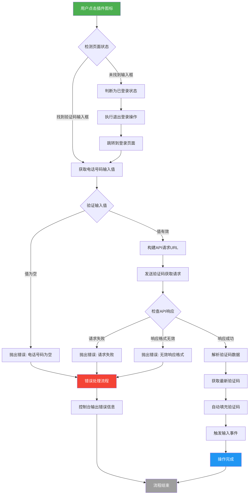

# 测试环境登录注册简化插件

**背景**：在执行测试工作时，有些测试工作会频繁的使用登录注册的功能（支付权益，新手引导），操作流程为：

测试环境：输入邮箱 >> 获取验证码 >> 到验证码接受平台接收验证码 >> 输入验证码 >> 登录/注册
线上环境：获取临时邮箱 >> 输入邮箱 >> 获取验证码 >> 到临时邮箱平台接收验证码 >> 输入验证码 >> 登录/注册

对登录注册流程进行简化，简化（到验证码接受平台接收验证码 >> 输入验证码）步骤，不需要来回切换页面（由于当前公司内屏蔽了大部分临时邮箱服务，只保留https://www.moakt.com/，且网站请求内容等加密，因此线上无法使用该插件）


**处理流程**：

1. **正常流程** (绿色路径): 用户点击 → 检测页面 → 获取输入 → API请求 → 填充验证码 → 完成
2. **异常处理流程** (红色路径): 各种错误情况 → 错误处理 → 流程结束
3. **状态切换流程** (蓝色路径): 检测到已登录 → 退出登录 → 跳转登录页 → 继续正常流程



**功能代码摘要**：

1. **页面元素检测与获取**

```javascript
// 使用可靠的选择器方法检测页面元素
const inputElement = document.querySelector('.phoneCode');
return {
    value: inputElement?.value || null,
    exists: !!inputElement
};
```

**实现要点：**

- 使用可选链操作符安全访问属性
- 返回元素存在状态和值信息
- 避免因元素不存在导致的脚本错误

2. **状态检测与页面跳转逻辑**

```javascript
// 检测当前页面状态并执行相应操作
if (!elementExists) {
    // 如果未找到输入组件，执行退出登录流程
    const currentUrl = new URL(currentTab.url);
    const signOutUrl = currentUrl.origin + "/signout";
    const authBoxUrl = currentUrl.origin + "auth_box?type=signin";
    
    await chrome.tabs.update(currentTab.id, { url: signOutUrl });
    
    // 确保跳转到登录页面
    if (!afterTab.url.includes("auth_box?type=signin")) {
        await chrome.tabs.update(currentTab.id, { url: authBoxUrl });
    }
    throw new Error('未找到电话号码输入框');
}
```

3. **API请求构建与安全调用**

```javascript
// 构建安全的API请求URL
const apiUrl = new URL('https://api.example.com/get_codes');
apiUrl.searchParams.set('account', rawEmail);

// 发送带有安全头的网络请求
const response = await fetch(apiUrl, {
    method: 'GET',
    headers: {
        'Content-Type': 'application/json',
        'X-Requested-With': 'ChromeExtension'
    }
});
```

4. **响应数据验证与处理**

```javascript
// 验证API响应格式
if (!Array.isArray(responseData) || responseData.length === 0) {
    throw new Error('无效的API响应格式');
}

// 获取最新验证码
const [lastCode] = responseData.slice(-1);
```

5. **自动填充与事件触发**

```javascript
// 将验证码自动填充到输入框并触发事件
await chrome.scripting.executeScript({
    target: { tabId: tab.id },
    args: [lastCode.code],
    func: (code) => {
        const input = document.querySelector('.verify-code-input');
        input.value = code;
        // 触发输入事件确保表单验证
        input.dispatchEvent(new Event('input', { bubbles: true }));
        input.dispatchEvent(new Event('change', { bubbles: true }));
    }
});
```

6. **错误处理机制**

```javascript
try {
    // 主要业务逻辑
    // ...
} catch (error) {
    console.error('操作失败:', error.message);
    // 可扩展为用户友好的错误提示
}
```

